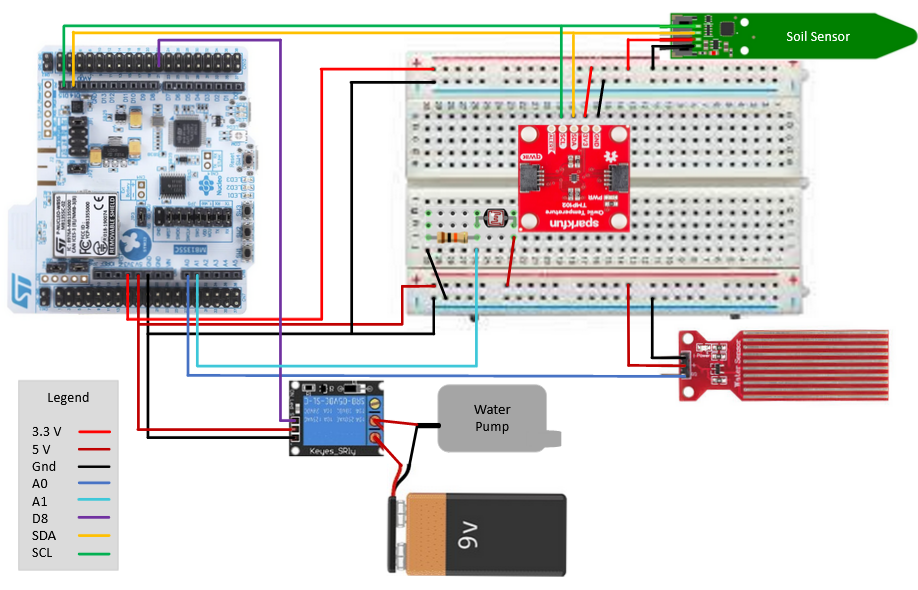

# Configure Plant Demo

>**Note**
    OTA certificates should be configured by the manufacturer. If your ExpressLink does not have an OTA certificate configured consult the manufacturer instructions found under the **User Guides**.

## Hardware Wiring

### Parts Needed

* P-NUCLEO-WB55 board by STMicroelectionics
* ExpressLink module
* Adafruit STEMMA Soil Sensor
* SparkFun Digital Temperature Sensor - TMP102
* Photocell
* Water Level Sensor
* 10K resistor
* 3-5V submersible water pump
* Breadboard Power Supply Module

### Wiring



Connect two 5V relays to the ST board. The first 5V relay should have the **Signal pin**
connected to **digital pin 7** and the second should have the signal connected to
**digital pin 8**. Both relays should have the VCC connected to the ST boards 5V pin and
the NO terminal connected to the 5V output of a power module.

#### **Water Level Sensor**

* For this interface, connect the signal pin of the sensor to **A0** on the ST board.
* Connect the **VCC** of the sensor to the **Common terminal** 5V relay
connected to digital pin 7 of the Arduino.
* Connect **GND** of the sensor to the Ground of the ST board.

#### **Photocell**

* Connect one end of the photocell to 5V to the **Common terminal** 5V relay
connected to digital pin 7 of the Arduino (this will share the Common terminal with the water level sensor)
* Connect the other end of the sensor to **A1** on the ST board.
* Connect one end of a 10K resistor from **A1** to **GND**

#### **Water Pump**

* Connect the **VCC** of the water pump to the **Common terminal** 5V relay connected to digital pin 8 of the ST board.
* Connect the **Gnd** of the water pump to the to the Ground of the ST board.

#### **Temperature and Soil Sensors**

* Connect the **VCC** of the temperature and soil sensors to the 3V output of the ST board.
* Connect the **Gnd** of the temperature and soil sensors to the to the Ground of the ST board.
* Connect the **SDA pin** of the sensors to SDA(**D14**) pin on the ST board.
* Connect the **SCL pin** of the sensors to SCL(**D15**) pin on the ST board.

## Arduino Configuration

To add the P-NUCLEO-WB55 board to Arduino Add this link in the "*Additional Boards Managers URLs*" field found under **Preferences** in the **File** Dropdown:

https://github.com/stm32duino/BoardManagerFiles/raw/main/package_stmicroelectronics_index.json

### Libraries needed

* ArduinoJSON v.5.x.x
* Adafruit seesaw
* Sparkfun TMP102 Breakout

### Configuration and Flashing

To configure your ExpressLink start by flashing the code onto a P-NUCLEO-WB55
board by STMicroelectionics. If this is the first time connecting to the
ExpressLink fill in your SSID, passphrase and AWS IoT Core Endpoint within
the `plant_reference.h`. The AWS IoT Core Endpoint can be found in the AWS IoT
console. In the navigation pane, choose **Settings**. Under
**Device data endpoint** select the **Endpoint** to make a copy of the endpoint
for your account. Prior to flashing the host board uncomment the
`expresslink_init()` call in the setup function, this will provision the board
with your WIFI and IoT Core endpoint. On execution you will see the `ThingName`
and `Certificate` printed within the Serial Monitor; you will need these in order
to add the ExpressLink to your AWS account. Note that the execution will enter
an infinite loop of attempting to connect until you add the ExpressLink device
to your AWS account.

## ExpressLink Configuration

To create an AWS IoT thing and add it to your account you must retrieve the AWS IoT ExpressLink module Thing Name and its corresponding certificate. Follow these steps:

1. Open the [AWS IoT Console](https://console.aws.amazon.com/iot/home).
In the navigation pane choose **Manage** then choose **Things**.
Choose **Create things**, select **Create single thing**, then choose **Next**.
2. Find the ThingName printed in the Serial Monitor and copy it.
3. Return to the AWS IoT console, and on the **Specify thing properties** page
under **Thing properties**, paste the string you copied from the terminal into
the **Thing name** field. Leave other fields with their default values, then
choose **Next**.
4. Find the Certificate(a longer sequence of alphanumeric symbols) printed in
the Serial Monitor and copy it. Save it in a text file on your host machine as
"`ThingName.cert.pem`".
5. In the AWS IoT console, on the **Configure device certificate** page, select
**Use my certificate**, then select **CA is not registered with AWS IoT**.
6. Under **Certificate**, choose **Choose file**. Select the file
"`ThingName.cert.pem`" that you created in a previous step, then choose **Open**.
7. Under **Certificate status**, select **Active**, then choose **Next**.
8. Under **Attach policies to certificate**, choose **Create policy**.
9. Enter a **Policy name** (for example, "IoTDevPolicy"), then under
**Policy document** select **JSON**.
10. Copy the following into the console **Policy document**:

    ```json
    { "Version": "2012-10-17",
      "Statement": [
        {
          "Effect": "Allow",
          "Action": "*",
          "Resource": "*" 
        } 
      ]
    }
    ```

    >  **WARNING**
    The examples in this document are intended only for development
    environments. All devices in your fleet must have credentials with
    privileges that authorize only intended actions on specific resources. The
    specific permission policies can vary for your use case. Identify the
    permission policies that best meet your business and security requirements.
    For more information, see
    [Example IAM identity-based policies](https://docs.aws.amazon.com/IAM/latest/UserGuide/access_policies_examples.html)
    and
    [Security Best practices](https://docs.aws.amazon.com/IAM/latest/UserGuide/IAMBestPracticesAndUseCases.html)
    in the *IAM Identity and Access Management User Guide*.
11. Choose **Create**. Return to the **Attach policies to certificate** page and
select the policy you just created (for example, "IoTDevPolicy"), then choose
**Create thing** to complete the thing creation.

## User Guides

[Getting Started with Expresslink](https://docs.aws.amazon.com/iot-expresslink/latest/gettingstartedguide/elgsg.html)

### Espressif

[Getting Started Guide for Espressif's AWS IoT ExpressLink Evaluation Kit on GitHub](https://github.com/espressif/esp-aws-expresslink-eval)

### Realtek

[Realtek's Ameba Z2 AWS IoT ExpressLink Evaluation Kit on GitHub](https://github.com/ambiot/ambz2_aws_iot_expresslink_eval)

### u-blox

[u-blox's USB-NORA-W256AWS AWS IoT ExpressLink Multiradio development kit](https://www.u-blox.com/en/product/usb-nora-w2?legacy=Current#Documentation-&-resources)

[u-blox's SARA-R510AWS module LTE-M AWS IoT ExpressLink module](https://www.u-blox.com/en/product/sara-r510aws-module?legacy=Current#Documentation-&-resources)

### Telit

[Telit's Bravo AWS IoT ExpressLink development kit on GitHub](https://github.com/telit/bravo-aws-expresslink)
